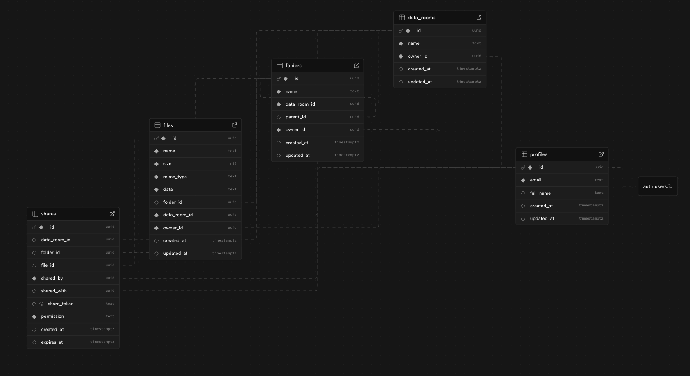

# Data Room MVP

_Automatically synced with your [v0.app](https://v0.app) deployments_

[](https://vercel.com/uabaluuas-projects/v0-data-room-mvp)
[](https://v0.app/chat/lOdM6ZXyseY)

## Overview

**Data Room MVP** is a secure document management and sharing platform built with Next.js and Supabase. It allows users to organize files and folders within data rooms, share them with specific users or via public links, and manage access permissions. This is particularly useful for business scenarios like due diligence, document collaboration, and secure file sharing.

### Key Features

- **Data Rooms**: Create and manage multiple data rooms to organize your documents
- **Hierarchical Folders**: Organize files in nested folder structures within data rooms
- **File Management**: Upload, view, rename, and delete files (currently supports PDFs)
- **Secure Sharing**: Share data rooms, folders, or individual files with:
  - Specific users via email (with view or edit permissions)
  - Public shareable links with optional expiration dates
- **User Authentication**: Secure authentication powered by Supabase Auth
- **Row Level Security (RLS)**: Database-level security policies ensure users can only access their own content or content shared with them
- **Real-time Updates**: React context manages state for seamless user experience

## Tech Stack

- **Framework**: Next.js 16 (App Router)
- **Language**: TypeScript
- **Database**: Supabase (PostgreSQL)
- **Authentication**: Supabase Auth
- **UI Components**: Radix UI primitives with custom styling
- **Styling**: Tailwind CSS
- **State Management**: React Context API
- **Deployment**: Vercel

## Database Structure

The application uses Supabase (PostgreSQL) with the following main tables:

- **profiles**: User profile information linked to Supabase Auth users
- **data_rooms**: Top-level containers for organizing documents
- **folders**: Hierarchical folder structure (supports nested folders via `parent_id`)
- **files**: File storage with base64-encoded content, metadata (size, mime_type), and folder relationships
- **shares**: Sharing relationships with support for:
  - User-to-user sharing (via `shared_with`)
  - Public link sharing (via `share_token`)
  - Permission levels (view/edit)
  - Optional expiration dates



### Database Scripts

The database setup is managed through SQL scripts in the `scripts/` directory:

1. **001_create_tables.sql**: Creates all tables, indexes, and relationships
2. **002_enable_rls.sql**: Enables Row Level Security and creates security policies
3. **003_create_profile_trigger.sql**: Automatically creates user profiles on signup
4. **004_create_search_function.sql**: Search functionality for finding content

## Security Features

The application implements comprehensive security through Supabase Row Level Security (RLS):

- **Ownership-based Access**: Users can only access their own data rooms, folders, and files
- **Share-based Access**: Users can access content shared with them via direct shares or public tokens
- **Permission Levels**: Shared content can have "view" or "edit" permissions
- **Token-based Public Access**: Secure public sharing via unique tokens with optional expiration
- **Database-level Enforcement**: All security policies are enforced at the database level, preventing unauthorized access even if application code is bypassed

## Project Structure

```
├── app/                    # Next.js App Router pages
│   ├── (auth)/            # Authentication routes (login, sign-up)
│   ├── (root)/             # Main application routes
│   │   ├── data-room/     # Data room pages
│   │   └── shared/        # Shared content pages
│   └── shared/            # Public shared content routes
├── components/             # React components
│   ├── ui/                # Reusable UI components (shadcn/ui)
│   ├── data-room-view.tsx # Main data room view component
│   ├── folder-view.tsx    # Folder navigation and display
│   ├── file-list.tsx      # File listing component
│   ├── share-dialog.tsx   # Sharing interface
│   └── ...
├── lib/                    # Utility libraries
│   ├── data-room-context.tsx  # React context for state management
│   ├── supabase/          # Supabase client configuration
│   └── storage.ts         # Storage utilities
├── types/                  # TypeScript type definitions
└── scripts/                # Database migration scripts
```

## Getting Started

### Prerequisites

- Node.js 18+ and pnpm (or npm/yarn)
- Supabase account and project
- Environment variables configured (see below)

### Installation

1. Clone the repository:
```bash
git clone <repository-url>
cd v0-data-room-mvp
```

2. Install dependencies:
```bash
pnpm install
```

3. Set up environment variables:
Create a `.env.local` file with your Supabase credentials:
```env
NEXT_PUBLIC_SUPABASE_URL=your_supabase_url
NEXT_PUBLIC_SUPABASE_ANON_KEY=your_supabase_anon_key
```

4. Set up the database:
   - Run the SQL scripts in the `scripts/` directory in order:
     - `001_create_tables.sql`
     - `002_enable_rls.sql`
     - `003_create_profile_trigger.sql`
     - `004_create_search_function.sql`

5. Run the development server:
```bash
pnpm dev
```

6. Open [http://localhost:3000](http://localhost:3000) in your browser

## Deployment

Project is live at:
**https://data-room.yehorov.dev**

The application is deployed on Vercel with automatic deployments from the main branch.

## Key Components

- **DataRoomProvider**: React context provider that manages application state (data rooms, folders, files) and provides CRUD operations
- **DataRoomView**: Main component for displaying a data room and its contents
- **FolderView**: Handles folder navigation and displays folders/files in the current location
- **ShareDialog**: Interface for sharing data rooms, folders, or files with users or generating public links
- **FileUploader**: Component for uploading files to data rooms or folders
- **PDFViewer**: Component for viewing PDF files in the browser

## Development Notes

- The application uses Supabase for both authentication and database, leveraging its built-in Row Level Security for secure data access
- File content is stored as base64-encoded strings in the database (suitable for MVP, but consider object storage for production at scale)
- The sharing system supports both authenticated user sharing and public token-based sharing
- All database operations respect RLS policies, ensuring data security

## License

Private project - All rights reserved
